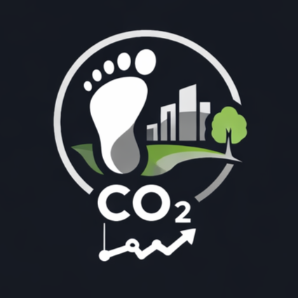

<div align="center">
  
  <h1>🌱 EcoMeterCO2</h1>
  <p>
    <strong>Daily Carbon Footprint Tracker with Kotlin Multiplatform</strong>
  </p>

  <p>
    <a href="https://kotlinlang.org"></a>
    <a href="https://www.jetbrains.com/lp/compose-multiplatform/"></a>
    <a href="https://opensource.org/licenses/MIT"></a>
  </p>
</div>

https://github.com/user-attachments/assets/0cfbbde7-4bef-43be-b880-c4d9d85df2c8

---

## 🎯 What It Does

EcoMeter is a **Kotlin Multiplatform** application that helps everyday people:
- **Track daily activities** (transport, food, energy, purchases) in under 60 seconds
- **See transparent CO₂e estimates** with clear methodology ("How we estimated it")
- **Get one personalized "Tiny Action"** each day with high impact and low effort
- **Compare footprint** with regional and global averages
- **Earn badges** for consistent eco-friendly choices

## 📱 Platforms

| Platform | Status | Technology |
|----------|--------|------------|
| Android | ✅ Ready | Compose Multiplatform |
| Web | ✅ Ready | Kotlin/Wasm + Kotlin/JS |

## 🏗️ Architecture

```
composeApp/
├── src/
│   ├── commonMain/          # ~90% shared code
│   │   └── kotlin/
│   │       ├── data/        # Repositories, Storage, Emission Factors
│   │       ├── domain/      # Models, Calculator, Tiny Action Engine
│   │       └── ui/          # Compose UI (shared across platforms)
│   ├── androidMain/         # Android-specific implementations
│   └── webMain/             # Web-specific implementations (JS + Wasm)
```

### Key Features

- **Deterministic Emission Calculator**: Uses UK Gov GHG Conversion Factors 2025
- **Tiny Action Engine**: Personalized recommendations using epsilon-greedy algorithm
- **Local-first Storage**: All data stays on device, export/import via JSON
- **Privacy-first**: No login required, no cloud dependency for core features

## 🚀 Quick Start

### Prerequisites
- JDK 11+ (Android Studio bundled JDK works)
- Android Studio / IntelliJ IDEA

### Run Android App
```shell
# Windows
.\gradlew.bat :composeApp:assembleDebug

# macOS/Linux
./gradlew :composeApp:assembleDebug
```

### Install on Android Device
```shell
# Windows
.\gradlew.bat :composeApp:installDebug

# macOS/Linux  
./gradlew :composeApp:installDebug
```

### Run Web App (Wasm - Modern Browsers)
```shell
# Windows
.\gradlew.bat :composeApp:wasmJsBrowserDevelopmentRun

# macOS/Linux
./gradlew :composeApp:wasmJsBrowserDevelopmentRun
```

### Run Web App (JS - Wider Browser Support)
```shell
# Windows
.\gradlew.bat :composeApp:jsBrowserDevelopmentRun

# macOS/Linux
./gradlew :composeApp:jsBrowserDevelopmentRun
```

## 📊 Data Sources

EcoMeterCO2 uses scientifically-backed emission factors:

| Source | Used For |
|--------|----------|
| [UK Gov GHG Conversion Factors 2025](https://www.gov.uk/government/publications/greenhouse-gas-reporting-conversion-factors-2025) | Transport, Energy |
| [Poore & Nemecek 2018](https://science.sciencemag.org/content/360/6392/987) | Food emissions |
| [EPA GHG Emission Factors Hub](https://www.epa.gov/climateleadership/ghg-emission-factors-hub) | Validation |

## 🎮 Features

### Daily Check-in (30 seconds)
Quick activity logging with 4 categories:
- 🚗 **Transport**: Car, bus, train, flight, bike, walk
- 🍽️ **Food**: Meal types (beef, chicken, vegan, etc.)
- ⚡ **Energy**: Electricity (kWh), heating, AC
- 🛒 **Purchases**: Clothing, electronics, misc

### Today's Footprint
- Total CO₂e for the day
- Breakdown by category with visual progress bars
- "How we estimated it" transparency

### One Tiny Action
- Personalized daily recommendation
- Based on your dominant emission category
- Tracks completion with streak and badges

### Weekly Insights
- 7-day trend visualization
- Comparison with regional averages (Global, EU, USA, LATAM)
- Paris Agreement sustainable target tracking

### Settings
- Export all data as JSON
- Import data (replace)
- Clear all data
- Methodology & privacy info

## 🏆 Gamification

| Badge | Requirement |
|-------|-------------|
| 🌱 First Step | Complete first tiny action |
| 🔥 On a Roll | 3-day streak |
| 🏆 Week Champion | Complete 7 tiny actions |

## 🔒 Privacy

- **100% local storage** - No account required
- **No tracking** - Your data never leaves your device
- **Export anytime** - Full JSON export of all your data
- **Open source** - Verify the code yourself

## 📁 Project Structure

```
Ecometer/
├── composeApp/
│   ├── build.gradle.kts     # KMP configuration
│   └── src/
│       ├── commonMain/      # Shared code (~90%)
│       ├── androidMain/     # Android platform code
│       └── webMain/         # Web platform code (JS + Wasm)
├── gradle/
│   └── libs.versions.toml   # Dependency versions
└── README.md
```

## 🛠️ Tech Stack

- **Kotlin Multiplatform** 2.2.x
- **Compose Multiplatform** 1.9.x
- **kotlinx.serialization** for JSON
- **kotlinx.datetime** for date/time handling
- **Material 3** design system

## 📝 Essay

### Why EcoMeter?

Climate change is a global challenge that requires individual action. Most carbon footprint apps fail because they demand too much effort and provide numbers without actionable guidance. EcoMeter solves this with three key innovations:

**1. Ultra-fast capture**: Log activities in under 60 seconds with intuitive category cards.

**2. Transparent estimation**: Every CO₂e number shows exactly how it was calculated, building trust through transparency.

**3. One Tiny Action**: Instead of overwhelming users with generic advice, EcoMeter recommends ONE personalized action per day using an epsilon-greedy algorithm that considers your emission patterns and completion history.

The app is built with Kotlin Multiplatform, sharing ~90% of code between Android and Web platforms. This demonstrates KMP's power for building real-world applications that work across platforms while maintaining native performance.

EcoMeterCO2 is privacy-first by design—no login, no cloud dependency, all data stays local. Users can export/import their data as JSON, giving them full control.

The gamification layer (streaks and badges) encourages consistent behavior change without being intrusive. Environmental impact is a global concern, and EcoMeterCO2 helps everyone, everywhere, make better daily choices.

## 📄 License

This project is licensed under the MIT License - see the [LICENSE](LICENSE) file for details.

---

**Built with 💚 using Kotlin Multiplatform for KotlinConf 2026 Contest**

Learn more about:
- [Kotlin Multiplatform](https://www.jetbrains.com/help/kotlin-multiplatform-dev/get-started.html)
- [Compose Multiplatform](https://github.com/JetBrains/compose-multiplatform/)

